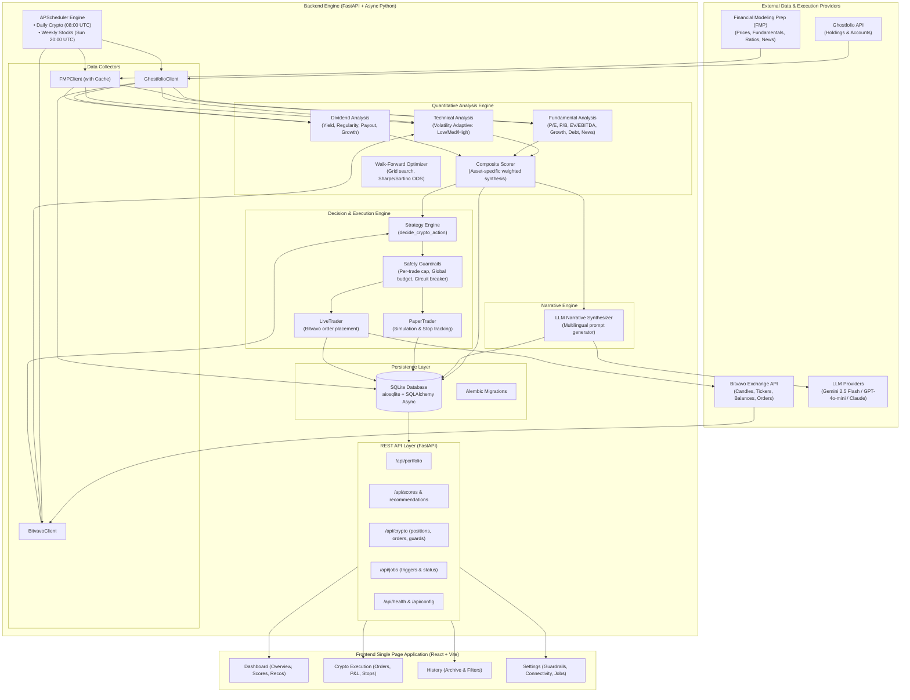
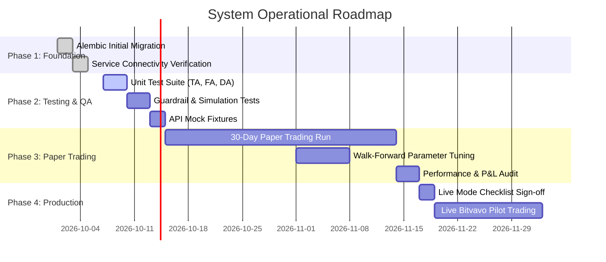

# Implementation Plan & System Architecture

**Market Analysis & Investment Recommendation System**  
*Automated multi-asset portfolio analysis and crypto execution engine.*

---

## 1. Executive Summary & Vision

The **Market Analysis & Investment Recommendation System** is an institutional-grade personal investment platform designed to manage and monitor a multi-asset portfolio (Stocks, ETFs, Bonds, and Cryptocurrencies) with two distinct execution tracks:

1. **Long-Term Wealth Management (Stocks, ETFs, Bonds):**
   - **Data Origin:** Self-hosted [Ghostfolio](https://ghostfolio.org) instance (PEA, CTO / Brokerage, Assurance-Vie, PER).
   - **Frequency:** Weekly cadence (Sunday 20:00 UTC).
   - **Mode:** **Human-in-the-loop recommendations**. Quantitative multi-factor scoring (Technical, Fundamental, Dividend) coupled with an LLM narrative synthesis (Google Gemini, OpenAI, or Anthropic) in French or English. No direct broker execution; actionable proposals for manual rebalancing.

2. **Automated Algorithmic Crypto Trading:**
   - **Data & Exchange:** [Bitvavo API](https://bitvavo.com) (EUR trading pairs).
   - **Frequency:** Daily cadence (08:00 UTC) with continuous position & trailing stop monitoring.
   - **Mode:** **Automated execution with strict safety guardrails**. Runs in **Paper Trading mode by default**, with an explicit, auditable transition path to live execution.
   - **Risk Management:** Per-trade budget caps, global portfolio allocations, trailing stop-losses, take-profit thresholds, and a multi-condition circuit breaker.

---

## 2. System Architecture



---

## 3. Data Model Specification

The database is built on SQLite via `aiosqlite` and mapped via SQLAlchemy 2.0 Async ORM in [`backend/app/models/`](file:///Volumes/home/Github/Automatic-Trading/backend/app/models):

| Model | Table | File Link | Purpose |
|---|---|---|---|
| [`Position`](file:///Volumes/home/Github/Automatic-Trading/backend/app/models/position.py#L26) | `positions` | [position.py](file:///Volumes/home/Github/Automatic-Trading/backend/app/models/position.py) | Snapshot of holdings synchronized from Ghostfolio with asset classes (`stock`, `etf`, `bond`, `crypto`) and account wrappers (`pea`, `brokerage`, `assurance_vie`, `per`). |
| [`MarketData`](file:///Volumes/home/Github/Automatic-Trading/backend/app/models/market_data.py#L12) | `market_data` | [market_data.py](file:///Volumes/home/Github/Automatic-Trading/backend/app/models/market_data.py) | Historical OHLCV bars and calculated technical indicators (RSI, MACD, Bollinger Bands, ATR, OBV). |
| [`Score`](file:///Volumes/home/Github/Automatic-Trading/backend/app/models/score.py#L12) | `scores` | [score.py](file:///Volumes/home/Github/Automatic-Trading/backend/app/models/score.py) | Individual technical, fundamental, and dividend factor scores alongside the composite score and signal. |
| [`Recommendation`](file:///Volumes/home/Github/Automatic-Trading/backend/app/models/recommendation.py#L23) | `recommendations` | [recommendation.py](file:///Volumes/home/Github/Automatic-Trading/backend/app/models/recommendation.py) | Long-term investment recommendations with confidence rating, action verb, and LLM narrative justification. |
| [`Order`](file:///Volumes/home/Github/Automatic-Trading/backend/app/models/order.py#L28) | `orders` | [order.py](file:///Volumes/home/Github/Automatic-Trading/backend/app/models/order.py) | Crypto buy/sell order records with fill price, status, stop-loss, take-profit, trailing stop watermark, signals snapshot, and realized P&L. |
| [`CircuitBreakerEvent`](file:///Volumes/home/Github/Automatic-Trading/backend/app/models/circuit_breaker.py#L12) | `circuit_breaker_events` | [circuit_breaker.py](file:///Volumes/home/Github/Automatic-Trading/backend/app/models/circuit_breaker.py) | Audit log of risk shutdowns triggered by consecutive losses or drawdown spikes. |
| [`IndicatorConfig`](file:///Volumes/home/Github/Automatic-Trading/backend/app/models/indicator_config.py#L12) | `indicator_configs` | [indicator_config.py](file:///Volumes/home/Github/Automatic-Trading/backend/app/models/indicator_config.py) | Parameter override registry resulting from walk-forward backtesting optimization. |

---

## 4. Quantitative Analysis Engine (§4)

### 4.1 Volatility-Adaptive Technical Analysis
Located in [`technical.py`](file:///Volumes/home/Github/Automatic-Trading/backend/app/analysis/technical.py):
- **Regime Detection:** Computes annualized volatility ($\sigma = \text{std}(\text{daily returns}) \times \sqrt{252}$).
  - *High Volatility* ($\sigma \ge 40\%$): Shortened windows for fast response (EMA 8/21, RSI 9, MACD 8/21/7, Bollinger 15).
  - *Medium Volatility* ($20\% \le \sigma < 40\%$): Standard windows (EMA 12/26, RSI 14, MACD 12/26/9, Bollinger 20).
  - *Low Volatility* ($\sigma < 20\%$): Smoothed windows to filter noise (EMA 21/55, RSI 21, MACD 21/55/12, Bollinger 30, std 2.5).
- **Sub-Score Aggregation:**
  - Trend ($35\%$): EMA alignment, SMA Golden/Death crosses, MACD line & histogram.
  - Momentum ($30\%$): RSI 0–100 mapping, Stochastic oscillator, Rate of Change (ROC).
  - Volatility & Reversion ($20\%$): Bollinger Band %B and squeeze breakout detection.
  - Volume & Confirmation ($15\%$): On-Balance Volume (OBV) trend vs price trend.

### 4.2 Fundamental Analysis
Located in [`fundamental.py`](file:///Volumes/home/Github/Automatic-Trading/backend/app/analysis/fundamental.py):
- **Valuation Metrics ($35\%$):** Non-linear scoring for P/E (10–15 optimal), P/B (<1.0–2.0), and EV/EBITDA (<8–14).
- **Growth & Profitability ($30\%$):** EPS growth, net profit margins, operating margins.
- **Financial Health & Solvency ($20\%$):** Debt-to-Equity ratios, current ratios.
- **Sentiment & Macro ($15\%$):** FMP news headlines sentiment scoring.
- **Specialized ETF Mode:** Weight shifts to Total Expense Ratio (TER/expense ratio) and tracking error.

### 4.3 Dividend Analysis
Located in [`dividend.py`](file:///Volumes/home/Github/Automatic-Trading/backend/app/analysis/dividend.py):
- **Yield ($35\%$):** Bell-curve scoring favoring sustainable yields (2.5%–6.0%) while penalizing yield traps (>10%).
- **Regularity ($30\%$):** History continuity over 5 years.
- **Payout Sustainability ($20\%$):** Optimal payout ratio between 30% and 65%.
- **Growth ($15\%$):** 3-to-5 year dividend CAGR.

### 4.4 Composite Weighting Matrix
Located in [`composite.py`](file:///Volumes/home/Github/Automatic-Trading/backend/app/analysis/composite.py):

| Asset Class | Technical Weight | Fundamental Weight | Dividend Weight | Rationale |
|---|---|---|---|---|
| **Stocks** | 40% | 35% | 25% | Balanced blend of valuation, growth, dividend safety, and entry timing. |
| **ETFs** | 35% | 30% | 35% | Focus on expense ratio, broad trend, and distribution yield. |
| **Bonds** | 20% | 30% | 50% | Heavy emphasis on coupon stability, credit health, and duration. |
| **Crypto** | 70% | 0% | 30% | Momentum & volatility driven; fundamentals omitted; on-chain/volume proxy. |

**Signal Decision Bounds:**
- `Score >= 75.0` $\rightarrow$ **Strong Buy**
- `62.0 <= Score < 75.0` $\rightarrow$ **Buy**
- `45.0 <= Score < 62.0` $\rightarrow$ **Hold**
- `38.0 <= Score < 45.0` $\rightarrow$ **Reduce**
- `Score < 38.0` $\rightarrow$ **Sell**

---

## 5. Execution & Risk Guardrails Engine (§5)

Located in [`guardrails.py`](file:///Volumes/home/Github/Automatic-Trading/backend/app/execution/guardrails.py), [`paper_trader.py`](file:///Volumes/home/Github/Automatic-Trading/backend/app/execution/paper_trader.py), and [`live_trader.py`](file:///Volumes/home/Github/Automatic-Trading/backend/app/execution/live_trader.py):

1. **Per-Trade Capital Cap:**
   - Single trade allocation cannot exceed `CRYPTO_PER_TRADE_CAP_PCT` (default: 5.0% of crypto portfolio).
2. **Global Budget Ceiling:**
   - Sum of open and pending trade commitments cannot exceed `CRYPTO_GLOBAL_BUDGET_EUR` (default: €1,000.00).
3. **Dynamic Stop Management:**
   - **Hard Stop-Loss:** Calculated at entry (`price * (1 - CRYPTO_STOP_LOSS_PCT / 100)`).
   - **Take-Profit:** Target price set at entry (`price * (1 + CRYPTO_TAKE_PROFIT_PCT / 100)`).
   - **High-Water Mark Trailing Stop:** Updates dynamically on higher prices (`highest_price * (1 - CRYPTO_TRAILING_STOP_PCT / 100)`).
4. **Three-Layer Circuit Breaker:**
   - Triggers when consecutive losing trades $\ge 3$ OR rolling window cumulative loss $\ge 15.0\%$ over 7 days.
   - Automatically blocks all buy executions, logs an event in [`CircuitBreakerEvent`](file:///Volumes/home/Github/Automatic-Trading/backend/app/models/circuit_breaker.py#L12), and requires manual operator intervention or cool-down reset.
5. **Fail-Safe Paper-to-Live Gate:**
   - Default mode is always `paper`. Live trading strictly requires `CRYPTO_LIVE_MODE=true` in `.env`.

---

## 6. Implementation Status Matrix

| Subsystem | Component | Status | Notes |
|---|---|---|---|
| **Database** | SQLAlchemy Async Models | **Complete** | All 7 tables defined with relationships and indexes. |
| **Database** | Alembic Migration Setup | **Complete** | `env.py` and `script.py.mako` ready. Initial version script to be committed. |
| **Collectors** | Ghostfolio Client | **Complete** | JWT authentication, holdings fetching, asset classification. |
| **Collectors** | FMP Client | **Complete** | Historical prices, key metrics, financial ratios, news sentiment, caching. |
| **Collectors** | Bitvavo Client | **Complete** | Balances, candles, ticker data, order placement (market/limit). |
| **Analysis** | Technical Analysis | **Complete** | 8 indicators, 3 volatility regimes, weighted score normalization. |
| **Analysis** | Fundamental Analysis | **Complete** | Valuation, growth, debt, news sentiment, ETF expense ratio logic. |
| **Analysis** | Dividend Analysis | **Complete** | Yield scoring, regularity checking, payout ratio, growth rates. |
| **Analysis** | Composite Scorer | **Complete** | Normalization, configurable weights per asset class, signal mapping. |
| **Analysis** | Walk-Forward Optimizer | **Complete** | Grid search, Sharpe & Sortino ratios, train/test split. |
| **LLM Engine** | Multi-Provider Support | **Complete** | Factory with Google Gemini, OpenAI, and Anthropic backends. |
| **LLM Engine** | Narrative Generation | **Complete** | French & English templates, prompt builder with factor breakdown. |
| **Execution** | Strategy Decision Engine | **Complete** | Position sizing based on signal confidence, sell/reduce handling. |
| **Execution** | Safety Guardrails | **Complete** | Per-trade cap, global budget, stop-loss, trailing stops, circuit breaker. |
| **Execution** | Paper Trader | **Complete** | Simulation engine, order history, stop checking against live prices. |
| **Execution** | Live Trader | **Complete** | Bitvavo exchange execution, gate checks, order status tracking. |
| **Scheduler** | APScheduler Jobs | **Complete** | Daily crypto cycle and weekly equity cycle with manual trigger endpoints. |
| **Backend API** | FastAPI Endpoints | **Complete** | Full suite of REST routes with CORS and OpenAPI documentation. |
| **Frontend UI** | Dashboard Page | **Complete** | Real-time portfolio summary, score gauges, signal badges, charts. |
| **Frontend UI** | Crypto Execution Page | **Complete** | Live/Paper status, open positions, order book, guardrail monitor. |
| **Frontend UI** | History Page | **Complete** | Historical recommendations archive, symbol filter. |
| **Frontend UI** | Settings Page | **Complete** | Live service health checks, guardrail parameter audit, manual job triggers. |
| **DevOps** | Docker & Compose | **Complete** | Backend and frontend containers, healthcheck, volume persistence. |
| **DevOps** | Automated Testing | **Pending** | `tests/` directory to be populated with pytest unit and integration suites. |

---

## 7. Phased Roadmap & Operational Checklist



### Phase 1: Environment & Migration Initialization
1. Copy `.env.example` to `.env` and configure credentials:
   - `GHOSTFOLIO_URL` & `GHOSTFOLIO_TOKEN`
   - `FMP_API_KEY`
   - `BITVAVO_API_KEY` & `BITVAVO_API_SECRET`
   - `LLM_PROVIDER` (`gemini` default) & `GEMINI_API_KEY`
2. Generate and apply the initial Alembic migration:
   ```bash
   cd backend
   alembic revision --autogenerate -m "initial_schema"
   alembic upgrade head
   ```

### Phase 2: Test Suite Implementation (`backend/tests/`)
Create test coverage for critical components:
1. `tests/test_technical.py`: Verify indicator formulas and regime transitions against reference pandas data.
2. `tests/test_guardrails.py`: Test per-trade cap breaches, budget exhaustion, and circuit breaker activation on loss streaks.
3. `tests/test_strategy.py`: Test signal-to-order sizing and buy/reduce/sell decision branches.
4. `tests/test_paper_trader.py`: Validate simulated order execution and trailing stop updates.

### Phase 3: Calibration & Paper Trading Validation (30 Days)
1. Run the system in `CRYPTO_LIVE_MODE=false`.
2. Monitor daily execution at 08:00 UTC via the UI Dashboard.
3. Run parameter optimization on historical Bitvavo data:
   - Invoke [`optimize_parameters`](file:///Volumes/home/Github/Automatic-Trading/backend/app/analysis/optimizer.py#L85) for the top 5 basket pairs.
   - Verify that out-of-sample Sharpe ratio exceeds the benchmark baseline.
4. Audit realized win-rate, slippage assumptions, and max drawdown.

### Phase 4: Production Live Trading Activation
Before flipping `CRYPTO_LIVE_MODE=true`:
- [ ] At least 30 consecutive days of paper trading without runtime errors.
- [ ] Circuit breaker successfully validated under simulated drawdown.
- [ ] Bitvavo API key scoped with IP restriction and withdrawal permissions disabled.
- [ ] Global budget capped conservatively (`CRYPTO_GLOBAL_BUDGET_EUR <= 500` for initial live run).
- [ ] Docker container auto-restart and volume persistence verified.

---

## 8. CLI & Operations Quick Reference

| Command | Description |
|---|---|
| `make setup` | Create initial `.env`, install backend and frontend dependencies. |
| `make dev` | Instructions for running backend and frontend in separate shells. |
| `make dev-backend` | Run FastAPI server on port 8000 with auto-reload. |
| `make dev-frontend` | Run Vite development server on port 5173. |
| `make migrate` | Execute all pending Alembic database migrations. |
| `make migrate-new MSG="..."` | Generate a new autogenerated Alembic migration. |
| `make docker-up` | Build and start backend and frontend containers with Docker Compose. |
| `make docker-down` | Stop running containers. |
| `make docker-logs` | Stream live container logs. |
| `make test` | Run pytest test suite across `backend/tests/`. |

---
*Document maintained automatically. For runtime configuration and secrets, refer to [`.env.example`](file:///Volumes/home/Github/Automatic-Trading/.env.example).*
